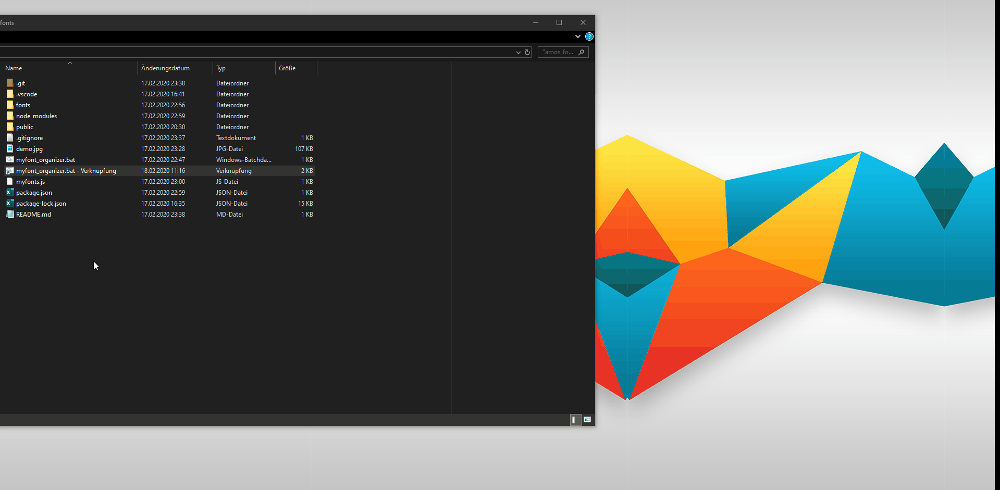

# node-fontviewer
Requirements: node.js 
`npm install express`

>fonts should be saved under "fonts/", as sibling directory to public/ and myfonts.js as pure file or as folder, no zip.
make a shortcut of myfont_organizer.bat to desktop.
 
>runs in your browser

>download the fonts for quick access by clicking its link

